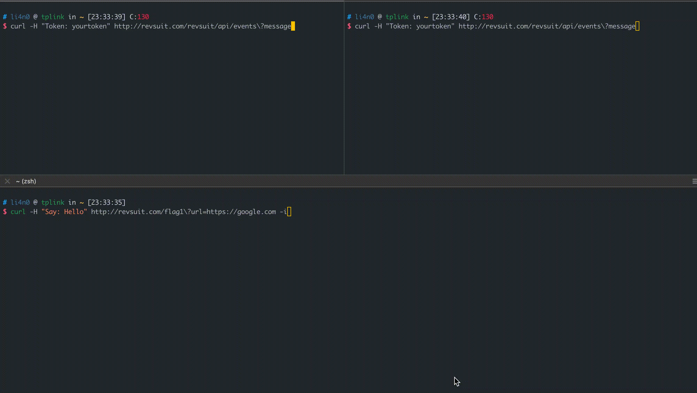
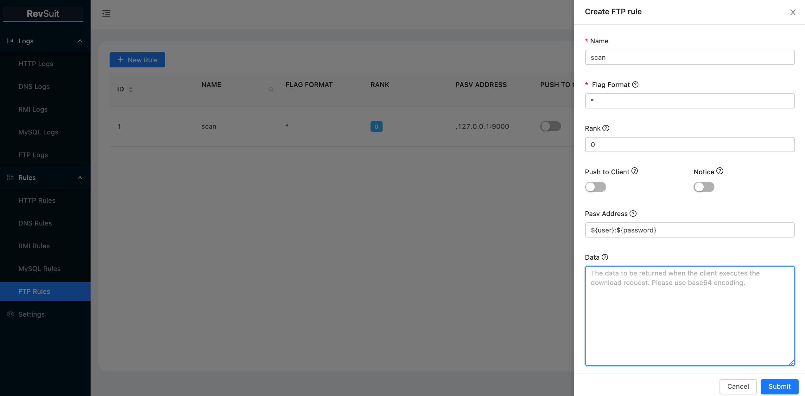

# RevSuit - A Flexible and Powerful Reverse Connection Platform

English ｜[简体中文](./README.zh-CN.md)

## Overview

RevSuit is a flexible and powerful reverse connection platform designed for receiving connection from target host in
penetration. It currently supports HTTP, DNS, RMI, LDAP, MySQL and FTP protocols.

Flexible:

1. RevSuit can set flexible rules to capture different connections.
2. Deploy and run via binaries without worrying about nasty dependency errors.

Powerful:

1. Allows to customize the response for different connections through rules and supports dynamic response generation
   using template variables.
2. Support a variety of protocols, and support the in-depth utilization of some protocols, such as DNS rebinding, MySQL
   Load Local Data, JDBC Deserialize Exploit, FTP Passive Mode SSRF, etc.
3. Native support for use with scanners.
4. Support push notifications to popular office software.
5. Other thoughtful and detailed features.

## Basic Usage

### Installation and Configuration

Download the latest release directly or build by following steps:

```bash
git clone https://github.com/Li4n0/revsuit.git
cd revsuit/frontend && yarn install && yarn build
cd ../ && go build ./cmd/revsuit/revsuit.go
```

RevSuit will generate default configuration file on first run. Modify the configuration file according to your needs,
then re-run. A detailed description of the configuration file can be found at: [Configuration Notes](./CONFIG.md)

### Run

In order to confirm the IP location, it needs to use the IP location database. `QQwry` is used as the data source by
default, you can also modify the configuration to use `GeoIP`. If the selected database is not available in the current
directory or the database is updated for more than a week, RevSuit will automatically download the latest database. If
the download fails, the `IpArea` field will always be null.

```bash
$ ./revsuit   
2021/05/16 22:55:10 [ INFO] Downloading qqwry.dat...

    ____            _____       _ __ 
   / __ \___ _   __/ ___/__  __(_) /_
  / /_/ / _ \ | / /\__ \/ / / / / __/
 / _, _/  __/ |/ /___/ / /_/ / / /_  
/_/ |_|\___/|___//____/\__,_/_/\__/    
                                   vBeta0.1
     https://revsuit.pro
2021/05/16 22:55:22 [ INFO] Starting HTTP Server at :80, token:your_token
2021/05/16 22:55:22 [ INFO] Start to listen FTP PASV port at :2020, PasvIP is 10.9.8.7
2021/05/16 22:55:22 [ INFO] Starting FTP Server at :21
2021/05/16 22:55:22 [ INFO] Starting MySQL Server at :3306
2021/05/16 22:55:22 [ INFO] Starting RMI Server at :1099
2021/05/16 22:55:22 [ INFO] Starting DNS Server at :53
```

After running, you can visit the `/revsuit/admin/` path of HTTP Server and enter the token to access the control panel.

### Create Rules and Receive Connection

Take the creation of HTTP rules as an example:

A few notes are as follows：

1. The `name` and `flagFormat` of rule are unique.
2. `FlagFormat` uses regular expression syntax, and for different protocols, the fields matched by flagFormat are
   different, you can check the corresponding hints to get details when creating rules.
3. Rules with high rank will take effect first.
4. For different protocol rules, you can make different custom responses, and for some protocols, template variables can
   be used.
5. You can set the named grouping of regular expressions in `flagFormat`, and the result of the matching grouping will
   also be used as a template variable.

As shown below, we create a rule that uses the built-in template variables and custom template variables of the http
protocol, and names it `test_create_rule`:


Then make a request that satisfies the rule and view the response.


The request will be logged on the platform at the same time.


### Notice

If you want to be notified of new connections on your office software, you can configure the webhook address of the
relevant software in the configuration file and turn on the `Notice` switch for the corresponding rule. Only support to
four software types currently: dingtalk,wechat,lark,slack.(Discord and telegram support is in the plan.)

### Import/Export Rules

If you're migrating platforms or purging data, it can be a hassle to recreate rules. That's why the platform supports
import and export of rules.

The entry point for this function is located at `Settings>RULES`.

The rules are stored in yaml format for import and export, like the following:

```yaml
http:
  - name: test_create_rule
    flag_format: (?P<what>\w+)\?
    rank: 0
    push_to_client: false
    notice: false
    response_status_code: "302"
    response_headers:
      Location: ${query.url}
    response_body: ${header.say} ${what}
  - name: other_rule
    flag_format: other
    rank: 1
    push_to_client: false
    notice: true
    response_status_code: "200"
    response_headers: { }
    response_body: Hello Revsuit!
dns:
  ... ...
```

## Advance Usage

### Use with Scanner

RevSuit was split from my scanner project, so its native support works with scanners.

From RevSuit's perspective, we call a scanner a client.

#### Establish connection

RevSuit
uses [HTTP Server-sent Events](https://developer.mozilla.org/en-US/docs/Web/API/Server-sent_events/Using_server-sent_events)
(SSE) to establish a one-way communication channel with the client.

The API for the channel is: `/revsuit/api/events?message` .The client first needs to add the `Token: your token` header
to the Header, and then access the API to establish the channel. When the platform receives a new connection, the `flag`
captured by the rule will be passed to the client through this channel.


Here is a [simple demo](https://gist.github.com/Li4n0/21aa0bec2d626114a729ca2677efb05a) using Golang's sse library as an
example.

#### Multi-client

As shown above, RevSuit supports multiple clients, and each client **in the connected state** receives a push of `flag`,
so distributed scanning can be supported.

If you don't want every client to receive all `flag` pushes, you can use the `Flag-Filter` request header when creating an sse connection to set the format(regular expressions) of the `flag` you want that client to receive:


#### Temporary storage queue

RevSuit will store `flag` temporarily in the queue when there is no client connection and send it when the client
connects, so you don't have to worry about missing the vulnerability because the client disconnects. (This is especially
helpful for discovering delay-triggered vulnerabilities.)

#### Use flagGroup

In a real-world vulnerability scanning scenario, you may send a large number of different payloads for a single
vulnerability point, and they may all be valid, which can result in the backlink platform receiving many requests, yet
they are caused by the same vulnerability. If you don't want the client to receive so many `flags` for the same
vulnerability, you can take advantage of the `flagGroup` feature of rule's flagFormat.

`FlagGroup` is the content matched by the anonymous group in the `flagFormat` field of the rule. The platform will check
the content matched in the grouping,and the flag is only pushed to the client when then content(`flagGroup`) captured
for the first time.

For example, SSRF scanning.

Firstly create a rule like the following:

```yaml
http:
  - name: ssrf
    flag_format: (ssrf[a-z0-9]{6})[0-9]{1,3}
    rank: 0
    push_to_client: false
    notice: false
    response_status_code: "200"
    response_headers: { }
    response_body: "Here is a SSRF!"
```

Suppose our target is `https://www.testvuln.com?url=api.com&p=useless`, and for SSRF we have 5 payloads. The final
request sent by the scanner may
be `['https://www.testvuln.com?url=http://revsuit.com/ssrfa98oni1&p=useless','https://www.testvuln.com?url=http://revsuit.com/ssrfa98oni2&p=useless', ... ,'https://www.testvuln.com?url=//revsuit.com/ssrfa98oni5&p=useless`']
. They may all attack successfully.

However, because anonymous grouping is used in the rule's `flagFormat`, The platform will query the
connected `flagGroup`, in this case `ssrfa98oni`, and push `flag` to the client only at its first appearance, so the
client will only receive one flag:`ssrfa98oni1`. It already proves that the `url` parameter of the target is vulnerable.

### Multi-module collocation

In actual penetration testing scenarios, certain tasks can be done easily and quickly by combining and matching various
modules of RevSuit. The following is an example of a blind XXE in Java Web, showing how to use RevSuit's HTTP and FTP
modules, combined with template variables, to quickly complete a port scan.

First create an HTTP rule to return evil.dtd, customize the response to the contents of dtd so that it goes to connect
to RevSuit's FTP service, and use template variables to pass the Host and Port to be scanned to FTP via FTP's user and
password.


Then create an FTP rule that receives the Host and port to be scanned from the user and password template variables, set
to Pasv Address.



Then use BurpSuit to launch the scan, by setting the host and port parameters in the evil.dtd URL to set the target of
the port scan.


The running effect is as follows:


It because the FTP connection will be crashed if `Passive Address` is not accessible, we can determine whether the port
is open or not based on whether the connection exits normally.For this example, we successfully detected that port 8005
and 8080 are open.

## More Usage

A more detailed wiki is being prepared, you can explore by yourself before it.

## Feedback, Suggestions and Communication

Submit an issue or contact me through Weixin: `TGk0bjA2Cg==`

## Acknowledgements

### Reference

This project draws on the code of the following outstanding projects:

* [https://github.com/rmb122/rogue_mysql_server](https://github.com/rmb122/rogue_mysql_server)
* [https://github.com/256dpi/newdns](https://github.com/256dpi/newdns)
* [https://github.com/EmYiQing/JNDIScan](https://github.com/EmYiQing/JNDIScan)

### Specifically

Thanks to my friend [@E99p1ant](https://github.com/wuhan005/) for all the help and advice I received during the
development of this project.

## License

@Apache License 2.0
