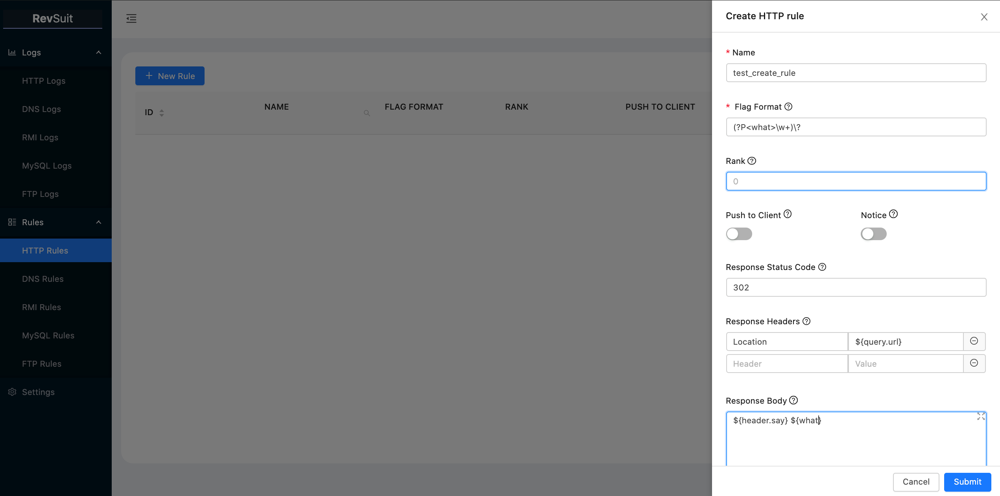
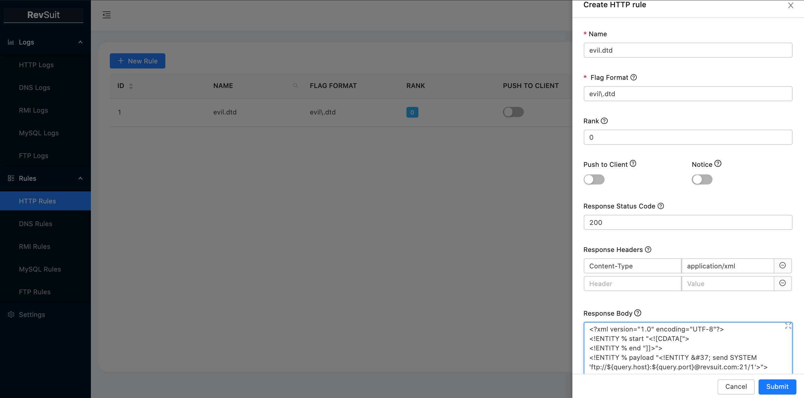
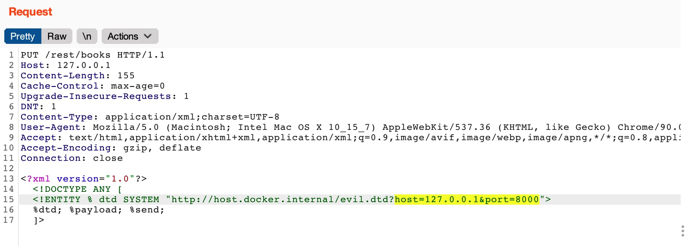

# RevSuit - A Flexible and Powerful Reverse Connection Platform

简体中文 ｜[English](./README.md)

## 简介

RevSuit 是一款灵活并且强大的反连平台。目前支持 HTTP、DNS、RMI、LDAP、MySQL 和 FTP 协议。

灵活：

1. 通过灵活的规则来捕获连接
2. 通过二进制文件部署和运行而无需担心讨厌的依赖错误

强大:

1. 可以通过规则，为不同类型的连接自定义响应，并且可以使用模板变量实现动态响应。
2. 支持的协议数量相对较多，并且支持其中的部分协议的进一步利用，如 DNS重绑定、MySQL客户端文件读取和 JDBC 反序列化、FTP 被动模式 SSRF 等
3. 原生支持扫描器
4. 支持发送通知到流行的办公软件
5. 其它有趣或贴心的功能

## 基础使用

### 安装及配置

在 Releases 里下载最新版本的 RevSuit，或者通过以下命令自行编译：

```bash
git clone https://github.com/Li4n0/revsuit.git
cd revsuit/frontend && yarn install && yarn build
cd ../ && go build ./cmd/revsuit/revsuit.go
```

RevSuit首次运行将会在当前目录生成配置文件，您可以根据需要自定义其中的某些内容。配置文件的详细说明可见：[配置说明](./CONFIG.zh-CN.md)

### 运行
为了确认连接 IP 的归属地，RevSuit 需要依赖 IP 归属地数据库。默认情况下使用纯真 IP 库，你也可以在配置文件中指定使用 GeoIP。如果当前目录下没有被选中的IP数据库文件，或者IP数据库文件更新的时间大于一周，RevSuit
将会自动下载最新版的数据库文件到本地。如果下载失败，连接记录的`IpArea`字段将始终为空。

```bash
$ ./revsuit   
2021/05/16 22:55:10 [ INFO] Downloading qqwry.dat...

    ____            _____       _ __ 
   / __ \___ _   __/ ___/__  __(_) /_
  / /_/ / _ \ | / /\__ \/ / / / / __/
 / _, _/  __/ |/ /___/ / /_/ / / /_  
/_/ |_|\___/|___//____/\__,_/_/\__/    
                                   vBeta0.1
     https://revsuit.pro
2021/05/16 22:55:22 [ INFO] Starting HTTP Server at :80, token:your_token
2021/05/16 22:55:22 [ INFO] Start to listen FTP PASV port at :2020, PasvIP is 10.9.8.7
2021/05/16 22:55:22 [ INFO] Starting FTP Server at :21
2021/05/16 22:55:22 [ INFO] Starting MySQL Server at :3306
2021/05/16 22:55:22 [ INFO] Starting RMI Server at :1099
2021/05/16 22:55:22 [ INFO] Starting DNS Server at :53
```

在启动之后，你可以通过访问HTTP Server的`/revsuit/admin/`路径，并输入 token 来进入控制面板。

### 创建规则与接收连接

这里以创建一个HTTP规则作为例子：

一些需要注意的内容如下：

1. 规则的 `name` 和 `flagFormat` 字段是唯一的。
2. `flagFormat` 使用正则表达式语法。对于不同的协议，其匹配的字段也是不同的。你可以在创建规则的时候查看对应的帮助信息来获知该协议的哪个字段是会被匹配的。
3. `rank` 决定了规则的优先级，如果一个请求同时满足多条规则，只有 `rank` 值最大的那条规则会生效。
4. 对于不同的协议，你可以设置不同的响应，部分协议可以使用模板变量来动态生成响应。
5. 你可以在 `flagFormat` 中使用正则表达式中的命名分组，命名分组匹配的结果将会成为自定义的模板变量。

如下图所示，我们创建一个名为 `test_create_rule` 的HTTP协议的规则，其中使用了内置的模板变量和自定义的模板变量：



然后发送一个满足这条规则的请求来进行测试，可以看到响应的内容中各个模板变量都获取到了对应的值：


这条请求同时会被记录在平台：


### 通知

通过配置 Webhook 地址并打开对应规则的 `Notice` 开关，你可以通过办公软件接收新连接的通知。目前支持 钉钉、企业微信、飞书 和 slack。（计划会后续支持Discord 和 Telegram）

### 导入/导出规则

如果你想要迁移平台或者清除数据，重新创建规则可能是一件麻烦事。因此 RevSuit 支持导入和导出规则。

该功能位于 `Settings>RULES` 选项卡，如下所示，规则将会被以 yaml 的格式进行导入和导出：

```yaml
http:
  - name: test_create_rule
    flag_format: (?P<what>\w+)\?
    rank: 0
    push_to_client: false
    notice: false
    response_status_code: "302"
    response_headers:
      Location: ${query.url}
    response_body: ${header.say} ${what}
  - name: other_rule
    flag_format: other
    rank: 1
    push_to_client: false
    notice: true
    response_status_code: "200"
    response_headers: { }
    response_body: Hello Revsuit!
dns:
  ... ...
```

## 高级功能

### 与扫描器适配

RevSuit 拆分自我的扫描器项目，因此它原生支持搭配扫描器使用。

从 RevSuit 的视角，我们称扫描器为客户端。

#### 建立通信管道

RevSuit
使用  [HTTP Server-sent Events](https://developer.mozilla.org/en-US/docs/Web/API/Server-sent_events/Using_server-sent_events)
(SSE) 与客户端建立一条单向通信管道。

通信管道的API为 `/revsuit/api/events?message`。客户端只需携带 `Token: your token` 请求头，然后请求这个 API 来建立通信管道。这样当 RevSuit
捕获新连接的时候，匹配到的 `flag` 就会通过这条管道传递给客户端。


这里是一个使用 Go 语言的 sse 库编写客户端的[简单例子](https://gist.github.com/Li4n0/21aa0bec2d626114a729ca2677efb05a) 。

#### 多客户端

如上一节的图片里所展示的，RevSuit 支持多个客户端，每个在**连接状态**的客户端都会接收到 `flag` 的推送，因此分布式扫描也是支持的。

如果你不希望每个客户端都收到全部的 `flag` 推送，你可以在创建 sse 连接时，使用 `Flag-Filter` 请求头设置希望该客户端接受的 `flag` 的格式（支持正则表达式），例如:


#### 暂存队列

当没有客户端连接的时候，RevSuit 会把 `flag` 暂时存储到队列里，当有客户端连接的时候再进行推送。因此你不必担心因为客户端与 RevSuit 断开连接就错过漏洞。（这对发现延时触发的漏洞尤为有帮助）

#### 使用flagGroup

在真实的漏洞扫描情景中，对于一个漏洞点，往往会发送许多不同的 payload，它们可能全部是有效 payload，这会导致 RevSuit
收到很多个连接，然而这些连接背后的漏洞其实是同一个。如果你不想客户端收到代表同一个漏洞的 `flag`
，你可以使用 `flagGroup`。

`flagGroup` 是被规则中的 `flagFormat` 中的匿名分组所匹配到的内容。RevSuit 将会检查 `flagGroup` 是否已经在之前的连接中被捕获过，只有当 `flagGroup`
是首次出现时，才会推送 `flag`
到客户端。

以针对 SSRF 漏洞扫描为例：

首先我们创建一个如下的规则：

```yaml
http:
  - name: ssrf
    flag_format: (ssrf[a-z0-9]{6})[0-9]{1,3}
    rank: 0
    push_to_client: false
    notice: false
    response_status_code: "200"
    response_headers: { }
    response_body: "Here is a SSRF!"
```

假设我们的目标是 `https://www.testvuln.com?url=api.com&p=useless`，并且针对 SSRF 漏洞，我们有5个
payload，最后被扫描器发出的请求是：`['https://www.testvuln.com?url=http://revsuit.com/ssrfa98oni1&p=useless','https://www.testvuln.com?url=http://revsuit.com/ssrfa98oni2&p=useless', ... ,'https://www.testvuln.com?url=//revsuit.com/ssrfa98oni5&p=useless`']
，它们可能全部攻击成功.

然而，因为我们在规则的 `flagFormat` 中使用了匿名分组，RevSuit 将会在数据库中查询连接的 `flagGroup`，在这个例子里也就是 `ssrfa98oni` ，只有当它是第一次出现时，才会向客户端推送 `flag`
，所以客户端只会收到 `ssrfa98oni1` 这一个 `flag` ，这足以确认这个请求的 URL 参数存在漏洞了。

### 多模块联动

在实际的渗透测试场景中，一些特定的操作可以通过 RevSuit 多个模块配合，快速、简单地完成。下面以一个 Java Web 环境中 盲XXE 漏洞利用场景为例，展示如何使用 RevSuit 的 HTTP 和 FTP
模块，配合模板变量，快速完成内网端口扫描。

首先创建一个 HTTP 规则来返回 evil.dtd, 使被攻击的目标去连接 RevSuit 的 FTP 模块，并且通过设置 FTP 连接的用户名和密码为模板变量来传递我们要扫描的 IP 和端口。



然后创建一个 FTP 规则，其中 `Pasv Address` 的 Host 和 Port 通过模板变量从 FTP 连接的用户名和密码动态获取。


然后使用 BurpSuit 即可进行扫描，通过设置 evil.dtd 请求中的 host 和 post 参数，来指定要扫描的目标端口：



运行效果如下:


因为在 FTP被动模式 中如果 `Passive Address` 是不可达的， FTP 的连接会中断，因此我们可以通过检查 FTP 的连接是否正常退出，来判断端口是否开放。对于上面这个例子，我们成功的探测出 8005 端口和 8080
端口是开放的。

## 更多用法

一个更详细的 wiki 正在准备中，在此之前你可以自己探索...

## 反馈、建议与交流

提交 Issue 或者通过微信联系我`TGk0bjA2Cg==`

## 致谢

### 引用

本项目引用了如下优秀项目的代码：

* [https://github.com/rmb122/rogue_mysql_server](https://github.com/rmb122/rogue_mysql_server)
* [https://github.com/256dpi/newdns](https://github.com/256dpi/newdns)
* [https://github.com/EmYiQing/JNDIScan](https://github.com/EmYiQing/JNDIScan)

### 特别感谢

感谢我的朋友[@E99p1ant](https://github.com/wuhan005/) 在我开发这个项目过程中给予非常多的建议和帮助。

## 开源许可协议

@Apache License 2.0
